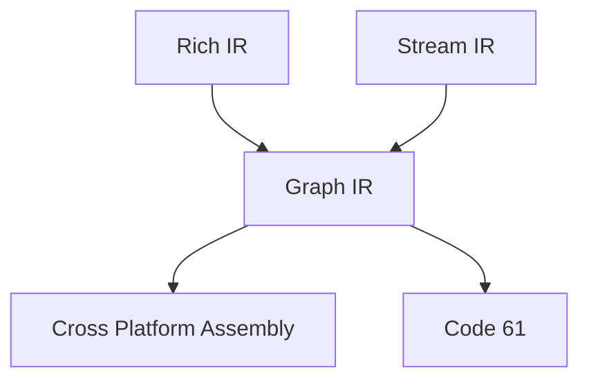

# cfvm

The 云流 (CloudFlow) Virtual Machine.

## 架构 / Frame

***Rich IR** 是个富语义 IR。*

***Rich IR** is a Rich Semantic IR.*

***Stream IR** 是个栈机 IR。*

***Stream IR** is a Stack Machine IR.*

***Cross Platform Assembly** belongs to [峨眉(EMei)](https://github.com/imlyzh/emei) Project.*

***Code 61** belongs to [Project61](https://github.com/pr61) Digital Circuit Proecessing Project.*
